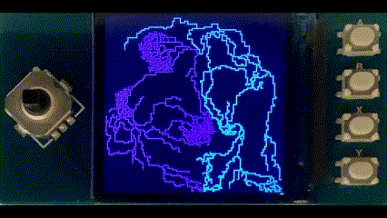

# Raspberry Pico Waveshare LCD Demo
# Physarum Growth
#### Waveshare 240 x 240 LCD with Joypad + Buttons demo for Raspberry Pico

Extensively modified version of [jlswbs Physarum Cellular Automata](https://github.com/jlswbs/Pico_ST7789_240x240/tree/main/Physarum) for
Waveshare 1.3 Inch LCD panel [^1] with Joypad and 4 buttons. 

Major Changes include :

* Conversion from Arduino Sketch to Pico SDK/C 

* Conversion from Pico PIO to SPI interface for ST7789 LCD

* IRQ-driven joypad & keypad routines

* Framebuffer and DMA transfer for ST7789 LCD

* USB serial port for menus and Pico Reset if required

This demo extends the original by adding functionality for the 5-way Joypad and 4 buttons on the Waveshare panel.

LCD Display Pin Numbers

  
| Function   | Waveshare Panel Pin | 
|------------| :------------------:|
| `DC`       |          8          |
| `CS`       |          9          |
| `CLK`      |         10          |
| `DIN`      |         11          |
| `RESET`    |         12          |
| `BL`       |         13          |

Joypad Pins and Functions

| Pin | Joypad     |  Physarum Population Function           |
|:---:|------------|-----------------------------------------|
|  2  | `UP`       |  Physarum Growth Count - Increase       |
| 18  | `DOWN`     |  Physarum Growth Count - Decrease       |
| 16  | `LEFT`     |  Physarum Population Density - Decrease | 
| 20  | `RIGHT`    |  Physarum Population Density - Increase |
|  3  | `CENTRE`   |  Restart Physarum Animation             | 

Keypad Pins and Functions

| Pin | Keypad     | Physarum Palette Function |
|:---:|:----------:|---------------------------|
| 15  | `A`        | Re-Randomise Colours      |
| 17  | `B`        | Decrement Colours         |
| 19  | `X`        | Invert Colours            |
| 21  | `Y`        | Merge Colours             |

[Pre-Built UF2 image here]
(https://github.com/Serialcomms/Raspberry-Pico-Waveshare-ST7789-Physarum/releases/download/Physarum/waveshare_physarum.uf2)

[^1]:https://www.waveshare.com/wiki/Pico-LCD-1.3

